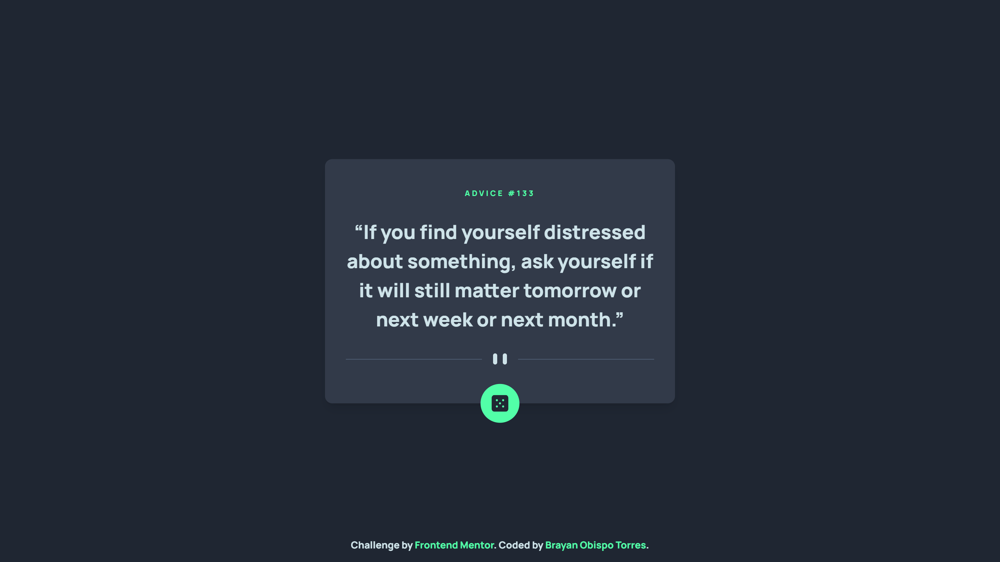

# Frontend Mentor - Advice generator app solution

This is a solution to the [Advice generator app challenge on Frontend Mentor](https://www.frontendmentor.io/challenges/advice-generator-app-QdUG-13db). Frontend Mentor challenges help you improve your coding skills by building realistic projects.

## Table of contents

- [Overview](#overview)
  - [The challenge](#the-challenge)
  - [Screenshot](#screenshot)
  - [Links](#links)
- [My process](#my-process)
  - [Built with](#built-with)
- [Author](#author)
- [Acknowledgments](#acknowledgments)

## Overview

### The challenge

Users should be able to:

- View the optimal layout for the app depending on their device's screen size
- See hover states for all interactive elements on the page
- Generate a new piece of advice by clicking the dice icon

### Screenshot

### Links

- Solution URL: [Click here](https://www.frontendmentor.io/solutions/advice-generator-app-with-react-and-tailwind-css-HJzDF19rc)
- Live Site: [Click here](https://brayanobisto.github.io/advice-generator-app/)

## My process

### Built with

- Semantic HTML5 markup
- Flexbox
- Mobile-first workflow
- [React](https://reactjs.org/) - JS library
- [Tailwind CSS](https://tailwindcss.com/) - CSS Framework

## Author

- Frontend Mentor - [@brayanobisto](https://www.frontendmentor.io/profile/brayanobisto)
- Twitter - [@brayanobisto](https://www.twitter.com/brayanobisto)

## Acknowledgments

To [Frontent Mentor](https://www.frontendmentor.io/) for giving me the opportunity to improve my coding skills ❤️
